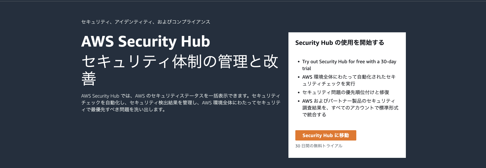
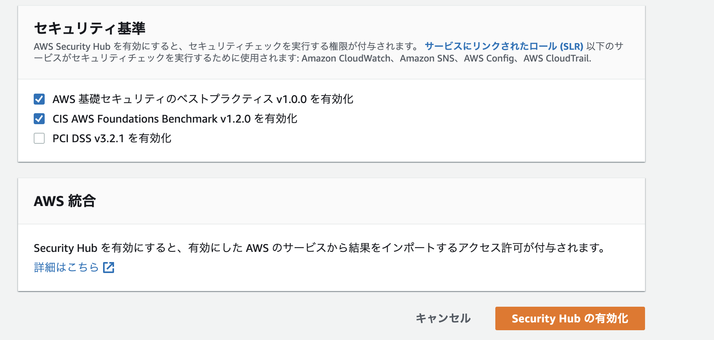

# AWSのセキュリティ系サービスを全て有効化する

今回はこちらのブログにそって以下サービスを全て有効化するためのレシピとなる

https://dev.classmethod.jp/articles/aws-security-all-in-one-2021/

ただし、Configの全てのルールを全てのリージョンで有効化するものであるためコストは随時確認していく必要がある。

頻繁に更新されるリソースがあり、コストが嵩む場合はルールの適用をしないことも検討する。

- CloudTrail
- GuardDuty
- Config
- SecurityHub

SecurityHubで `High` または `Critical` な状態はSlackチャンネルに投稿されるように設定する。

Slackチャンネルへの通知には `ChatBot` を利用する。

2022.4.7時点で Terraformでは `ChatBot`のリソースを作成できないので、一部ハンズオンがあるので注意。
(Lambda関数を使って代用は可能であるが、将来的には対応するであろうことを見越してあえてChatBotを利用)

## 手順

### Slackチャンネルの準備とWebHookURLの準備

以下を参考にWebhookUrlを発行しておきます。

https://qiita.com/vmmhypervisor/items/18c99624a84df8b31008

後ほどChatBot作成時に利用するので控えておいてください。

### SecurityHubの有効化(手動)



自分のメインにしたいリージョンでセキュリティハブを有効化します。

SecurityHubのサービスに移動して「SecurityHubに移動」を押下します



今回は以下のルールのみ有効化します

- AWS 基礎セキュリティのベストプラクティス v1.0.0 を有効化

### Terraformでリソース群を作成

```bash
cd infra/global
terraform init
terraform plan
terraform apply
```

### Chatbotの作成(手動)

こちらのブログ 「3.AWS Chatbotの設定」の手順どおりにChatbotを作成します。

https://blog.serverworks.co.jp/tech/2020/05/22/securityhub_chatbot/

